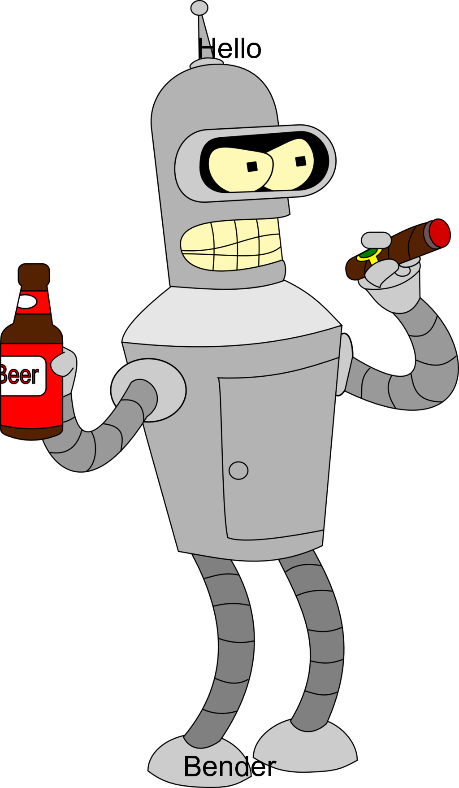

# Meme scraper

Scrapes this website:

[memegen-link-examples-upleveled.netlify.app](https://memegen-link-examples-upleveled.netlify.app/)

...and saves the first 10 images into a folder called "memes" within the directory of the new project.

Additionally you can create your own meme with an image of Bender (Futurama) by adding a top and a bottom text.

1. Scrape first 10 memes
2. Create own meme

## Scrape first 10 memes

You can scrape the first 10 memes from

[memegen-link-examples-upleveled.netlify.app](https://memegen-link-examples-upleveled.netlify.app/)

by executing the following command line:

`node index.js https://memegen-link-examples-upleveled.netlify.app/`

The downloaded memes are stored in the a memes folder in the same root folder as index.js is stored in.
Each meme file is name test[0-9].jpeg

## Create own meme

You can create your own meme with Bender on it, with a top and bottom text by executing the following command line syntax

`node index.js [Text on the top of the meme] [Text on the bottom of the meme] bender`

Here is an example:

`node index.js Hello Bender bender`

